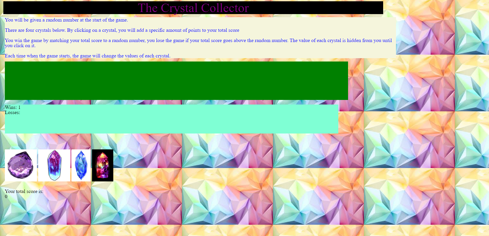

## The Crystal Collector
In this project, The user beigns with 4 crystals. The game then starts with a random number. The total score can not go above that number or they will lose. Each crystal has a random value hidden. After the user clicks the crystals the value will be added to the total score once clicked. Technologies Used: HTML, CSS, javascript and jQuery.

## Click [Here](https://ausar1989.github.io/Unit-4-game/) For The Website.

This is this an image of the website:

 An Example of Gameplay:
 

Technologies Used:
*HTML
*CSS
*Javascript
*jQuery